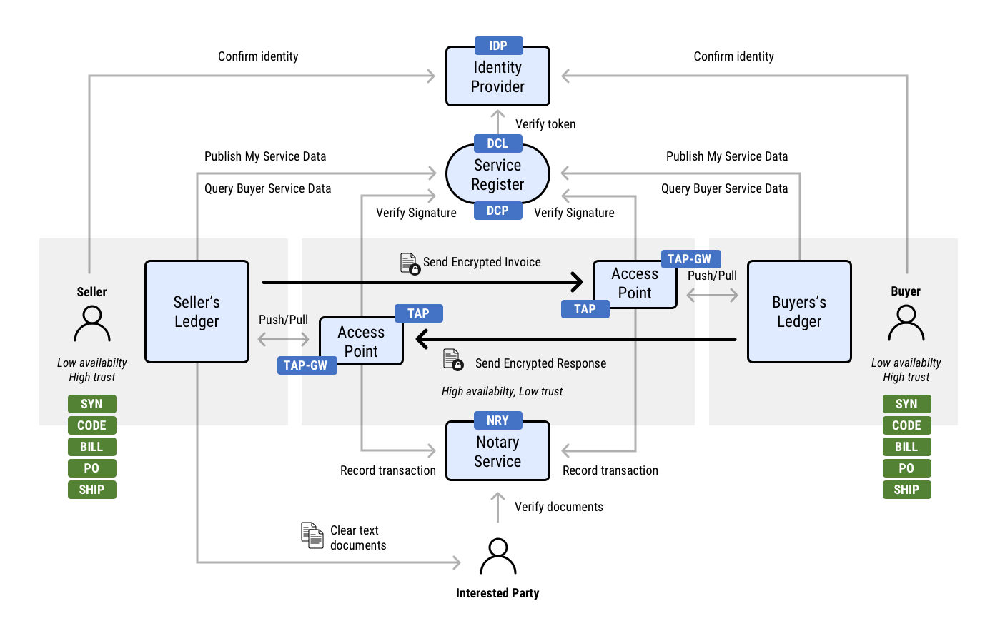

# Purpose of this site

Exchange of buisness documents like invoices between business finance systems ought to be as simple as email.  This site provides some open specifications and test services designed to make that easy.

 * As a business, I want to send electronic invoices to my customer systems and know the payment status so I can manage my cashflow and get cheap debtor financing if I need it.
 * As a business I want all invoices and tax receipts from my authorised suppliers to be automatically loaded to my financial system ready for my approval so I can reduce my administration burden.

We want the simplest, lowest cost and most secure solution to these needs so we've developed a suite of RESTful API standards and thrown in strong identity measures that support end-to-end encryption and digital signatures.  This site supports implementers by providing:

 * A suite of technical specifications with free test points:
   * [Digital Capability Locator](digital-capability-locator)
   * [Identity Provider](identity-provider)
   * [Notary](notary)
   * [Service Metadata Publisher](service-metadata-publisher)
   * [Transaction Access Point](transaction-access-point)
 * A suite of semantic specifications and free test points.
   * [Billing Semantics](billing-semantics)
   * [Purchase Order Semantics](purchase-order-semantics)
   * [Fulfillment Semantics](fulfillment-semantics)
 * A transparent governance model where any stakeholder is free to participate.

The semantic and technical specifications are open community processes based around the GitHub collaborative development environment. Business stakeholders may prefer to sign up for a <a href="http://eepurl.com/ctZ6hf">AusDigital general announcement</a> newsletter.

# Background

The [Australian Digital Business Council](http://digitalbusinesscouncil.com.au/) has published an interoperability framework that aims to increase national productivity through automation of common buisness processes such as invoicing. The standards are based on a "4 corner model" from Europe that depends heavily on traditional EDI hubs and B2B standards like ebXML. Although workable, uptake has been slow in Europe and so the Digital Business Council has also created a RESTful working group that aims to provide a simpler and more secure peer-to-peer implementation model based on ubiquitous internet standards such as REST.  This site is the repository for those specifications. 

# How it Works 

Unlike single provider APIs (eg google or facebook), a B2B community needs all businesses to implement the same interface so that the same document format (e.g. an invoice) can be sent from any business to any other business. The diagram shows how it works.

1. A business that wishes to participate in the network first proves their identity via an OIDC "log in with.." an identity provider service.  Different identity assurance levels are supported in an open identity market.  
2. With an IDP token at given identity assurance level, the business publishes their service end-point and public key to a metadata publisher in accordance with the SMP specification.  So, for example, the the SMP will now show (with medium level of assurance) that "ACME" identified by ABN=12345678911 provides an e-invoice service at https://api.acme.com.au/v1/invoice 
3. ACME's supplier "Widget Co" has also verified identity and published their services to the SMP. When Widget Co wants to send and invoice to ACME, then Widget Co will lookup ACME's service infomation (using ACME's ABN as the lookup key).
4. Widget will digitally sign the invoice and then use ACME's public key to encrypt it.  Then Widget will POST the invoice to ACME's service end point in accordance with the TAP (Transaction Access Point) specification.
5. ACME will verify Widget's signature, decrypt the invoice, and process it in ACME's financial system.  At each key stage in the invoice lifecycle (received, approved/disputed, paid), ACME will send an invoice response document to Widget Co.
6. Both Widget and ACME will optionally record the signed invoices and responses in the blockchain using the Notary (NRY) specification.  This provides both a non-repudiable transaction audit log and can be used by authorised third parties to provide additional services like invoice financing (so Widget Co can get paid immediately even though ACME's terms are 60 days net). 
7. In most cases, all these steps 1 to 6 will be performed automatically by ACME's and Widget's financial software.  

The success of the interoperability framework depends on uptake by the ledger software providers. Those systems must implement a number of interfaces in a consistent way - which requires clear standards, good test services, and easy to use tooling.  That is the purpose of this site.
